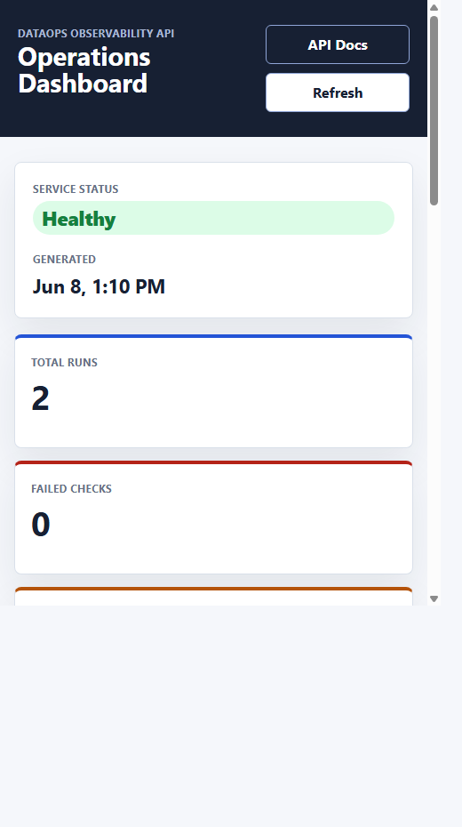

# DataOps Observability API

[](https://github.com/Bmowville/dataops-observability-api/actions/workflows/ci.yml)

[](LICENSE)

A FastAPI service for tracking data pipeline runs, quality checks, and operational status.

The service keeps operational metadata for data workflows in a small API surface with typed routes, database migrations, test coverage, Docker support, and CI quality gates.

It is shaped as a lightweight operations layer for teams that need more than scattered logs but do not need a full observability platform. Pipelines can report run status and quality checks into the API, then operators can use the dashboard or metrics endpoints to see what needs attention first.



## Product Direction

Most pipeline monitoring tools stop at raw events, logs, or generic charts. This project is designed around the operator workflow:

- one place to see current pipeline health
- one response that combines run status, quality results, stale work, and recommended actions
- a pipeline registry for owners, cadences, runbooks, and stale thresholds
- a small dashboard that makes the API useful immediately after seeding sample data
- integration-friendly endpoints for Airflow, dbt, cron jobs, GitHub Actions, or custom ETL scripts
- optional API-key protection for ingestion writes when the service is exposed outside a local machine
- webhook alerts for failed pipeline runs and quality checks that need operator attention
- alert delivery audit history so operators can verify which receiver was notified
- a codebase small enough for teams to adapt instead of adopting a heavy platform

See [docs/integrations.md](docs/integrations.md) for copy-paste examples that report pipeline events from Python jobs, GitHub Actions, Airflow, and dbt.

See [docs/operating.md](docs/operating.md) for self-hosted Postgres operation, API-key setup, webhook configuration, backups, and upgrade notes.

## Service Scope

- FastAPI application structure with versioned API routes
- SQLAlchemy 2.0 models and session management
- Alembic database migrations
- Pydantic request and response schemas
- Service-layer functions separated from route handlers
- Health checks with database connectivity
- Pytest tests using dependency overrides and isolated SQLite state
- Enforced branch coverage, Postgres integration checks, and Docker health smoke tests
- Ruff, strict mypy, GitHub Actions CI, Dependabot, and GitHub CodeQL default setup
- Dockerfile and Compose setup for self-hosted Postgres service runs
- GHCR publishing with commit-addressable SHA tags, an SBOM, and build provenance

## Domain

The API tracks operational metadata for data workflows:

- Pipeline registry: owner, source system, cadence, stale threshold, alert severity, runbook, and enabled status
- Pipeline runs: source system, status, timing, records processed, and errors
- Quality checks: check name, severity, status, expected value, observed value, and details
- Summary metrics: run counts, stale active runs, failing quality checks, pipeline health, and severity rollups

## Quick Start

```powershell
python -m venv .venv
.\.venv\Scripts\Activate.ps1
python -m pip install --upgrade pip
python -m pip install -e ".[dev]"
Copy-Item .env.example .env
python scripts/demo_setup.py
uvicorn app.main:app --reload
```

Open:

- Dashboard: http://127.0.0.1:8000/dashboard
- API docs: http://127.0.0.1:8000/docs
- Liveness check: http://127.0.0.1:8000/live
- Health check: http://127.0.0.1:8000/health

The demo setup runs migrations and reseeds a realistic operating state with registered pipeline ownership, a successful pipeline, a failed historical run, a stale active run, quality checks, recommended actions, and recent alert delivery attempts.

Re-run `python scripts/demo_setup.py` any time you want to reset the local demo data back to the same inspectable state.

## Integrations

The API is designed to receive events from pipeline tools instead of replacing them. Start with the examples in `examples/integrations/`:

- `python_reporter.py` for cron jobs, notebooks, scheduled scripts, or custom ETL
- `github-actions-report.yml` for CI-driven pipeline runs
- `airflow_dag.py` for Airflow task reporting
- `dbt_run_results.py` for turning dbt run results into quality checks

Full setup notes live in [docs/integrations.md](docs/integrations.md).

Register pipelines with owners, cadences, stale thresholds, and runbook URLs before reporting runs. The dashboard and operations overview use those definitions to explain who owns stale work and which runbook should be opened.

Set `INGESTION_API_KEYS` to require external reporters to send `X-DataOps-API-Key` on write requests. Read-only dashboard and metrics endpoints stay open so operators can inspect service health without sharing ingestion credentials.

Set `ALERT_WEBHOOK_URLS` to send operational alerts to Slack-compatible bridges, incident tooling, or custom automation when runs fail/cancel or quality checks warn/fail.

Webhook delivery attempts are persisted and exposed through `/api/v1/alerts/deliveries`, `/api/v1/alerts/deliveries/latest`, and the dashboard.

## Run Quality Gates

```powershell
ruff check .
mypy app
alembic upgrade head
python -m pytest
```

## Example Requests

Register a pipeline:

```bash
curl -X POST http://127.0.0.1:8000/api/v1/pipelines \
  -H "Content-Type: application/json" \
  -H "X-DataOps-API-Key: $DATAOPS_API_KEY" \
  -d '{"name":"daily_orders_load","owner":"Data Platform","source_system":"warehouse","expected_cadence_minutes":1440,"stale_after_minutes":90,"alert_severity":"high","runbook_url":"https://runbooks.example.com/orders-daily-load"}'
```

Create a pipeline run:

```bash
curl -X POST http://127.0.0.1:8000/api/v1/pipeline-runs \
  -H "Content-Type: application/json" \
  -H "X-DataOps-API-Key: $DATAOPS_API_KEY" \
  -d '{"name":"daily_orders_load","source_system":"warehouse","status":"running","records_processed":0}'
```

Add a quality check:

```bash
curl -X POST http://127.0.0.1:8000/api/v1/pipeline-runs/1/quality-checks \
  -H "Content-Type: application/json" \
  -H "X-DataOps-API-Key: $DATAOPS_API_KEY" \
  -d '{"check_name":"row_count_minimum","status":"passed","severity":"high","expected_value":"1000+","observed_value":"1284"}'
```

Seed and inspect local sample data:

```powershell
python scripts/demo_setup.py
Invoke-RestMethod "http://127.0.0.1:8000/api/v1/pipelines"
Invoke-RestMethod "http://127.0.0.1:8000/api/v1/pipeline-runs/latest?name=orders_daily_load"
Invoke-RestMethod "http://127.0.0.1:8000/api/v1/metrics/pipelines"
Invoke-RestMethod "http://127.0.0.1:8000/api/v1/metrics/operations-overview?stale_after_minutes=60"
Invoke-RestMethod "http://127.0.0.1:8000/api/v1/metrics/quality-checks"
Invoke-RestMethod "http://127.0.0.1:8000/api/v1/metrics/stale-pipeline-runs?max_age_minutes=60"
Invoke-RestMethod "http://127.0.0.1:8000/api/v1/alerts/deliveries?limit=5"
```

## Docker

```bash
docker compose up --build
```

Compose starts Postgres plus the FastAPI app on port `8000`. The API waits for Postgres and runs Alembic migrations before Uvicorn starts. Configure `.env` before exposing the service, especially `POSTGRES_PASSWORD`, `INGESTION_API_KEYS`, `PUBLIC_BASE_URL`, and webhook settings.

For operational setup, backup, restore, and upgrade commands, see [docs/operating.md](docs/operating.md).

## API Surface

| Method | Path | Purpose |
| --- | --- | --- |
| GET | `/live` | Process liveness without a database dependency |
| GET | `/health` | Readiness check with database connectivity |
| POST | `/api/v1/pipelines` | Register a pipeline owner, cadence, stale threshold, and runbook |
| GET | `/api/v1/pipelines?enabled=true` | List registered pipelines, optionally filtered by enabled status |
| GET | `/api/v1/pipelines/{name}` | Read one registered pipeline definition |
| PATCH | `/api/v1/pipelines/{name}` | Update pipeline ownership, SLA, runbook, or enabled status |
| POST | `/api/v1/pipeline-runs` | Create a pipeline run |
| GET | `/api/v1/pipeline-runs` | List pipeline runs, optionally filtered by status |
| GET | `/api/v1/pipeline-runs/latest?name={pipeline_name}` | Read the latest run for a pipeline name |
| GET | `/api/v1/pipeline-runs/{run_id}` | Read one pipeline run |
| PATCH | `/api/v1/pipeline-runs/{run_id}` | Update run status/details |
| GET | `/api/v1/pipeline-runs/{run_id}/timeline` | Read ordered lifecycle and quality-check events |
| POST | `/api/v1/pipeline-runs/{run_id}/quality-checks` | Add a quality check to a run |
| GET | `/api/v1/pipeline-runs/{run_id}/quality-checks` | List quality checks for a run |
| GET | `/api/v1/metrics/summary` | Operational summary counts |
| GET | `/api/v1/metrics/operations-overview?stale_after_minutes=60` | Combined operator dashboard snapshot with recommended actions |
| GET | `/api/v1/metrics/prometheus?stale_after_minutes=60` | Prometheus-style text metrics for scraper integrations |
| GET | `/api/v1/metrics/pipelines` | Pipeline health rollups grouped by name |
| GET | `/api/v1/metrics/quality-checks` | Quality-check counts grouped by severity and status |
| GET | `/api/v1/metrics/stale-pipeline-runs?max_age_minutes=60` | Active pipeline runs older than the configured age threshold |
| GET | `/api/v1/alerts/deliveries?status=failed&limit=100` | List recent webhook delivery attempts, optionally filtered by result |
| GET | `/api/v1/alerts/deliveries/latest` | Read the latest webhook delivery attempt |

## Dashboard

The `/dashboard` page is a read-only operator view backed by `/api/v1/metrics/operations-overview` and `/api/v1/alerts/deliveries`. It surfaces the service status, summary counts, recommended actions, pipeline ownership, cadence, runbook links, quality-check rollups, stale active runs, and recent alert delivery results.

Run `python scripts/demo_setup.py`, start the app, and open `http://127.0.0.1:8000/dashboard` to see the project with demo data.

## Operations Overview

The `/api/v1/metrics/operations-overview` endpoint combines the service's most useful operational signals into one response for dashboards or runbooks:

- `service_status`: `healthy`, `degraded`, or `attention_required`
- `summary`: total runs, run statuses, and quality-check counts
- `pipeline_health`: owner, cadence, runbook, latest run state, and quality-check counts by pipeline name
- `quality_checks`: severity and status rollups
- `stale_pipeline_runs`: active runs older than their registered stale threshold, or the requested fallback threshold when unregistered
- `recommended_actions`: prioritized next steps for failed checks, failed latest runs, stale active runs, and warnings

## Configuration

Settings are loaded from environment variables.

| Variable | Default | Purpose |
| --- | --- | --- |
| `APP_NAME` | `DataOps Observability API` | FastAPI application name |
| `ENVIRONMENT` | `local` | Environment label returned by health checks. `production` requires at least one ingestion API key. |
| `DATABASE_URL` | `sqlite:///./dataops_observability.db` | SQLAlchemy database URL. Plain `postgres://` and `postgresql://` provider URLs are normalized for psycopg 3. |
| `API_PREFIX` | `/api/v1` | Versioned API prefix |
| `RUN_MIGRATIONS_ON_STARTUP` | `false` | Run Alembic migrations before starting the API process. Compose enables this for the API container. |
| `SERVER_HOST` | `0.0.0.0` | Host interface used by `scripts/start_api.py`. |
| `SERVER_PORT` | `8000` | Port used by `scripts/start_api.py`. |
| `SERVER_RELOAD` | `false` | Enable Uvicorn reload when starting through `scripts/start_api.py`. Keep disabled outside local development. |
| `INGESTION_API_KEYS` | empty | Comma-separated keys accepted by write/ingestion endpoints. When empty, local writes are open. |
| `PUBLIC_BASE_URL` | `http://127.0.0.1:8000` | Base URL used in generated dashboard and API links. |
| `ALERT_WEBHOOK_URLS` | empty | Comma-separated webhook URLs that receive operational alerts. |
| `ALERT_WEBHOOK_SECRET` | empty | Optional shared secret sent as `X-DataOps-Webhook-Secret` on alert deliveries. |
| `ALERT_WEBHOOK_TIMEOUT_SECONDS` | `5` | Timeout for each outbound webhook delivery. |
| `POSTGRES_DB` | `dataops_observability` | Database name used by Docker Compose Postgres. |
| `POSTGRES_USER` | `dataops` | Database user used by Docker Compose Postgres. |
| `POSTGRES_PASSWORD` | `change-this-local-password` | Database password used by Docker Compose Postgres. Change before exposing the service. |

When `INGESTION_API_KEYS` is set, these write endpoints require `X-DataOps-API-Key`:

- `POST /api/v1/pipelines`
- `PATCH /api/v1/pipelines/{name}`
- `POST /api/v1/pipeline-runs`
- `PATCH /api/v1/pipeline-runs/{run_id}`
- `POST /api/v1/pipeline-runs/{run_id}/quality-checks`

Use different keys during rotation by setting a comma-separated value such as `INGESTION_API_KEYS=old-key,new-key`. Store real keys in your deployment secret manager, CI secrets, or local `.env` file rather than committing them.

The application refuses to start with `ENVIRONMENT=production` when no ingestion key is configured. This prevents an accidentally public deployment from exposing anonymous write endpoints.

## Webhook Alerts

When `ALERT_WEBHOOK_URLS` is configured, the API sends background webhook alerts for events that normally need human attention:

- pipeline run status changes to `failed`
- pipeline run status changes to `canceled`
- quality check status is `failed`
- quality check status is `warning`

Successful runs and passed quality checks do not send alerts. This keeps notification volume focused on work that needs follow-up.

Example configuration:

```powershell
$env:PUBLIC_BASE_URL = "https://dataops.example.com"
$env:ALERT_WEBHOOK_URLS = "https://hooks.example.com/dataops,https://backup.example.com/dataops"
$env:ALERT_WEBHOOK_SECRET = "shared-secret"
```

Alert payloads include `event_type`, `severity`, `message`, the affected pipeline run, optional quality-check details, and links back to the dashboard, run detail endpoint, and timeline endpoint.

Each configured receiver attempt is recorded in `alert_deliveries` with the event type, sanitized receiver URL, result, HTTP status code when available, error message when available, and timestamp. Query recent attempts with:

```powershell
Invoke-RestMethod "http://127.0.0.1:8000/api/v1/alerts/deliveries?limit=20"
Invoke-RestMethod "http://127.0.0.1:8000/api/v1/alerts/deliveries?status=failed"
Invoke-RestMethod "http://127.0.0.1:8000/api/v1/alerts/deliveries/latest"
```

New delivery history and logs retain only the receiver origin. User information, path segments, query values, fragments, and exception text that could contain provider credentials are not persisted.

## Container Releases

The container workflow builds only from commits reachable from protected `main`, whether triggered by a merge, semantic version tag, or manual dispatch. It publishes lowercase GHCR image names with commit-addressable SHA tags, generates an SBOM, and attaches GitHub build provenance. Pull requests must first pass unit and coverage checks, a real Postgres migration and health check, and a non-root Docker smoke test. Deploy by image digest when registry-level immutability is required.

## Azure Deployment

Reviewed Bicep defines an Azure Container Apps deployment backed by Neon PostgreSQL. It pins the public API and migration job to the same immutable container digest, scales the API from zero to one replica, and gates each release on a successful database migration before the API is updated. Infrastructure compilation is part of CI.

Live service: [Dashboard](https://ca-dataops-api-prod.wonderfultree-ff9c3d86.eastus2.azurecontainerapps.io/dashboard) | [API documentation](https://ca-dataops-api-prod.wonderfultree-ff9c3d86.eastus2.azurecontainerapps.io/docs) | [Health](https://ca-dataops-api-prod.wonderfultree-ff9c3d86.eastus2.azurecontainerapps.io/health)

The production release was deployed and smoke-tested on July 28, 2026. Public reads remain open for portfolio inspection, while all write endpoints require the production ingestion key.

## Notes

SQLite is the default for local Python development. Docker Compose provides the recommended self-hosted Postgres path, including database health checks and migration-aware API startup.
